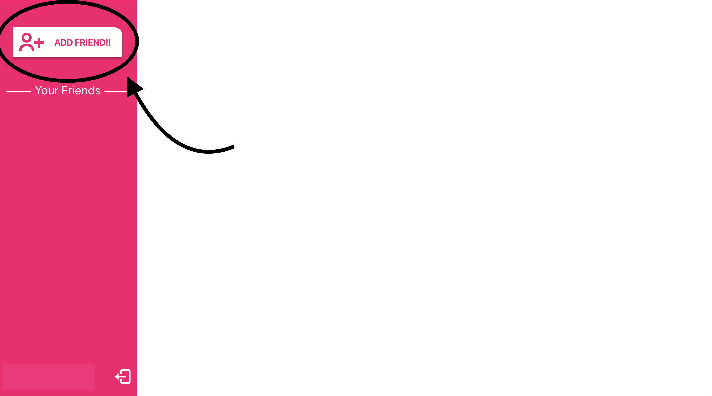
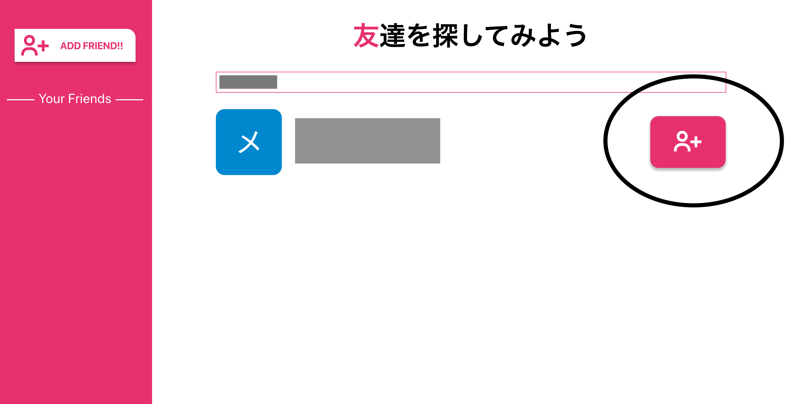
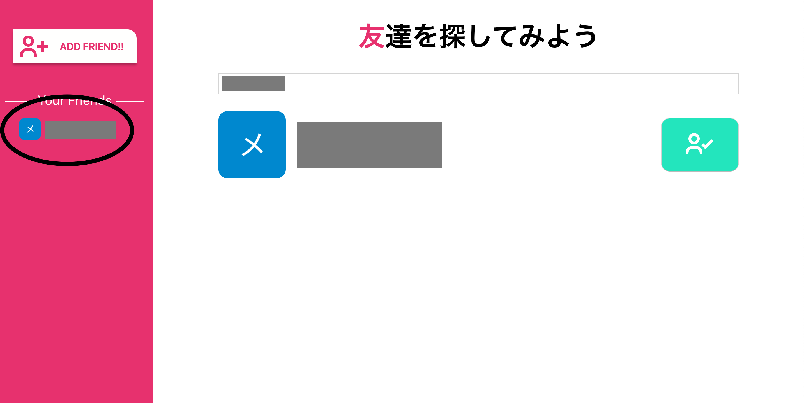

# simple-chat

## アプリケーションの概要
1対1でチャットをすることができるアプリケーションです

## アプリケーションの機能一覧
1. 友達追加機能
2. 1対1でのチャット

## 使用技術
|:rocket:|使用技術名|
|:---:|:----:|
|フロント| react v16.12.0 |
|バックエンド| firebase|
|その他| GitHub Actions|


## プロジェクトの起動
### 1. リポジトリをクローンする
```
$ git clone https://github.com/DuGlaser/simple-chat.git
```

### 2. 使用しているライブラリをインストールする
#### yarn
```
$ yarn
```

#### npm
```
$ npm i 
```

### 3. プロジェクトの起動
#### yarn
```
$ yarn start
```

#### npm 
```
$ npm start
```

## チャットのはじめ方
**注意：実際にリアルタイムでチャットがやりとりされてるのをみるのには２アカウント必要になります**
### 1. まずはgoogoleアカウントでログインしてください
### 2. 次にsideMenuのAdd Friend!!と書かれたボタンをクリックしてください

### 3. 次に入力フォームにチャットをしたい相手の名前を入れましょう。名前はgoogleアカウントの名前です。名前を入れると赤いボタンが出るのでクリックします。

### 4. 赤いボタンをクリックするとsideMenuにフレンドが追加され、そこをクリックするとchatルームに入ることができます。

